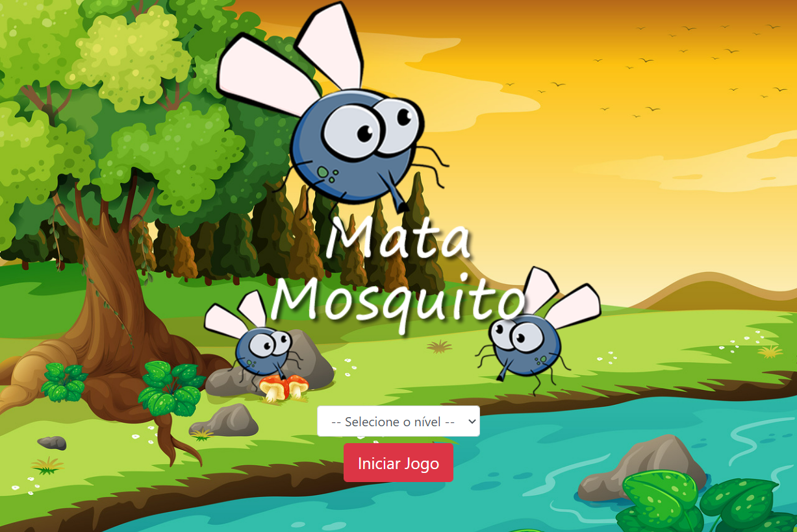

# App_mata_mosquito

> Recursos utilizados em aprendizado na Udemy

[Clique aqui] (https://marcusbragantini.github.io/app_mata_mosquito/)

🛠️## Tecnologias utilizadas
- HTML
- CSS
- JavaScripts
- Git e Github

## ---- Contato ----
🔗marcus@bragantini.com.br
